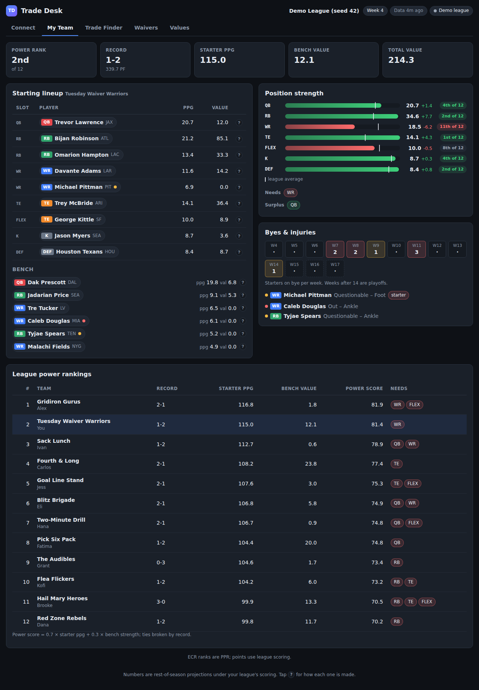
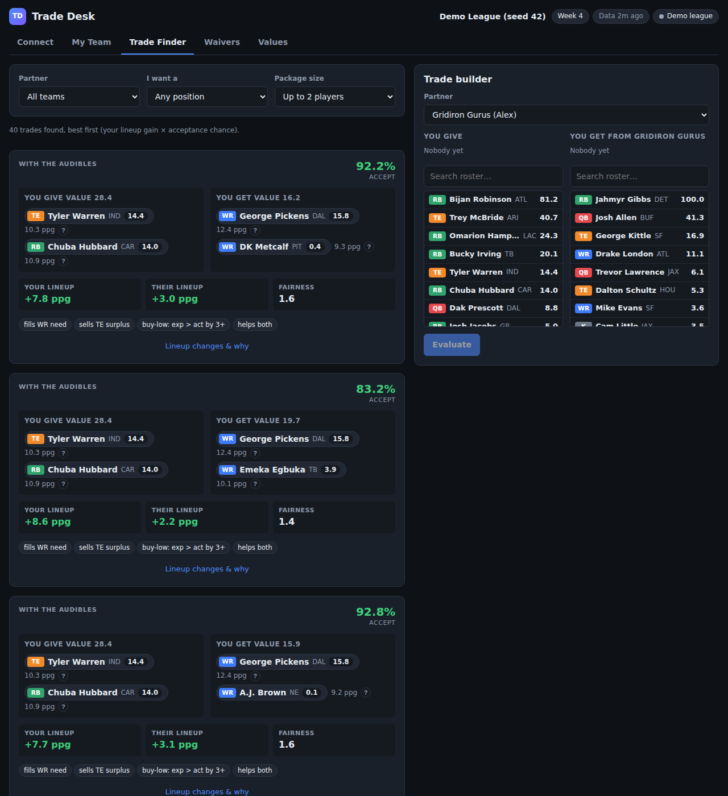

# Fantasy Trade Desk

A local web app that connects to your **Yahoo Fantasy Football** league, models
every player's rest-of-season value under *your league's* scoring and lineup
rules, and tells you which trades to propose, which free agents to pick up, and
whether a pickup is worth spending your waiver priority.

Everything runs on your machine. The only outbound calls are to Yahoo (your
league) and to public GitHub-hosted data files (player stats and rankings).
Nothing is written back to Yahoo; the app is read-only.



## Quick start

Requires Node 22+.

```bash
git clone <this repo> && cd FantasyFootball
npm install
cp .env.example .env        # fill in Yahoo credentials (see below) or skip for the demo
npm run dev                 # server on :3000, UI on http://localhost:5173
```

Production build (single server on http://localhost:3000):

```bash
npm run build && npm start
```

The first start downloads roughly 30 MB of player data into `.cache/` and takes
a minute. Later starts are instant; files refresh automatically after a few hours.

Click **Use demo league** on the Connect tab to explore with a realistic
12-team league drafted from current rankings. To use your own league, follow
[docs/YAHOO_SETUP.md](docs/YAHOO_SETUP.md) (about five minutes: create a free
Yahoo developer app, paste two values into `.env`, approve read access once).

## What it does

| Tab | What you get |
|---|---|
| **Connect** | Yahoo login, league and team picker, or the demo league. |
| **My Team** | Optimal lineup, position-by-position strength ranked against the league, needs and surplus, bye and injury exposure, power rankings. |
| **Trade Finder** | 1-for-1, 2-for-1 and 2-for-2 packages against every opponent, kept only when your lineup improves *and* the other side gets a deal they would plausibly accept. Each card explains both lineups' changes. Includes a builder to evaluate any offer. |
| **Waivers** | Free agents ranked by how much they improve your lineup versus your most droppable player, with trend and injury flags, and a claim / wait / optional / pass call that accounts for your rolling-list priority (or FAAB). |
| **Values** | Every player's projection, value, actual vs expected production, and owner, sortable and searchable. |



## How values are computed

Each player's projected points per game blends three signals under your
league's scoring: FantasyPros expert consensus rest-of-season rank (converted
to points on a positional curve), this season's *expected* fantasy points based
on opportunity (targets, carries, air yards) alongside actual points, and last
season's production as a stabiliser. That rate is multiplied by remaining
games, with byes, injuries and playoff weeks accounted for, and measured
against a replacement-level player for your league size and lineup slots.
Trade value is a convex transform of that surplus, so one star is worth more
than two mid-tier players. Every number in the UI has a **?** tooltip that
explains how it was made.

## Data sources

All free and keyless, refreshed automatically by their maintainers:

* [nflverse](https://github.com/nflverse/nflverse-data): rosters, schedule and byes, injury reports, snap counts.
* [ffopportunity](https://github.com/ffverse/ffopportunity): weekly actual and expected fantasy production.
* [DynastyProcess](https://github.com/dynastyprocess/data): FantasyPros expert consensus rankings and weekly projections, cross-platform player IDs, dynasty values.

## Scripts

| Command | Purpose |
|---|---|
| `npm run dev` | Server with reload on :3000 plus Vite UI on :5173 |
| `npm run build` / `npm start` | Build the UI, serve everything from :3000 |
| `npm test` | Unit and integration tests (engine, Yahoo parsers, API) |
| `npm run typecheck` | Strict TypeScript for server and web |

## Troubleshooting

* **Stale numbers**: delete `.cache/` to force a data refresh.
* **Yahoo says reconnect / 401**: delete `.data/yahoo-tokens.json` and connect again.
* **Yahoo 999**: rate limited; wait a few minutes. The app caches league imports for 15 minutes to avoid this.
* **A player shows as unmatched**: the app maps Yahoo players by ID, then by name, position and team. Rookies occasionally lack a Yahoo ID in the public crosswalk; they still match by name.
* **First live Yahoo run**: Yahoo could not be reached from the environment this app was built in, so the integration was written against the documented API and tested on fixtures. If an import fails, the error includes the endpoint and the raw response; see the troubleshooting section of [docs/YAHOO_SETUP.md](docs/YAHOO_SETUP.md).

## Layout

```
server/data        loaders for the public data files, player database
server/model       scoring, projection, lineup, analysis, trades, waivers
server/providers   yahoo (OAuth + import), demo
server/api.ts      HTTP API (contract in docs/DESIGN.md)
web/               React UI
docs/DESIGN.md     design spec and API contract
```
